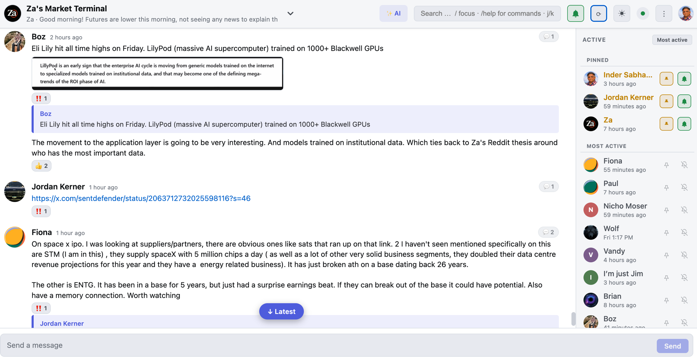
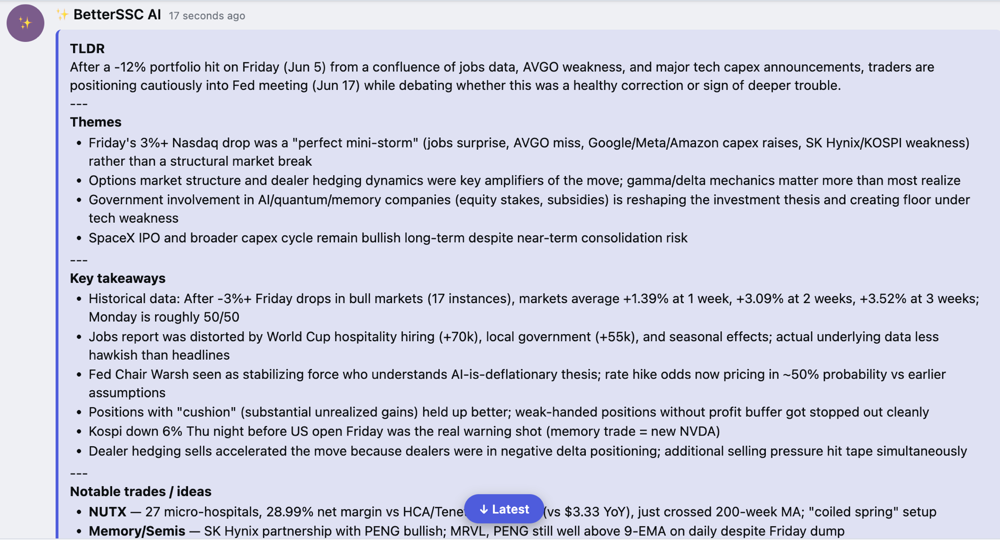

# BetterSSC

A Chrome extension that gives Substack Chat a Discord-style makeover.

  

Latest release: **v0.2.4** (Jun 8, 2026). 16 polish commits since the tag, on main. 233/233 tests passing.



**[Install](#install)** · **[Give feedback](https://github.com/inder/betterssc/issues/new)** · **[Roadmap](#roadmap)**

---

## Why this exists

Substack Chat is where a lot of really good traders and writers share their thinking in real time. The trouble is the interface gets in the way:

- Search usually doesn't find what you're looking for.
- If 200 people are posting, there's no easy way to focus on just the 3 you care about.
- You don't get notifications when a specific person posts, or even when someone @mentions you.
- Scroll position resets in weird ways when older messages load.
- Threads of 10 replies all show up as a flat wall of text.
- The whole thing feels like it was built for mobile first and never quite finished for desktop.

BetterSSC keeps your existing Substack account and reads from Substack's own API. It just paints a nicer layout on top so you can actually follow conversations.

## What it does (v0.2.4)

BetterSSC is primarily a **reader**. Most of the work is in the read side because that's where dense Substack chats actually fall apart. The send side is real and works, but it's not where you'll spend most of your time, so it comes last.

Read side at a glance: vi-key navigation, search + filters, inline ticker charts, desktop notifications, AI summaries. Details below.

### Reading the chat

- Two-pane Discord-style layout. Real names, real avatars, real emoji reactions.
- **Every message reads as a soft card.** A subtle accent tint on each author block makes message boundaries scannable; search hits intensify; the focused row gets a 3px accent bar on the left.
- When someone quotes another message, the quoted block is a clickable accent-color card. Click it to jump to the original and watch it flash amber so you can find it.
- Inline images, click for a full-screen lightbox. If an image fails to load it falls back to a "📎 image (click to open)" link.
- **Click any ticker symbol to open a free TradingView chart.** Both `$TICKER` syntax (`$NASA`, `$DXYZ`, `$BRK.B`) AND bare ALL-CAPS tickers from a curated allowlist (`AAPL`, `TSLA`, `BTC`, `SPY`, `QQQ`, etc.) render as accent-pill links. The modal embeds the daily chart with drawing tools (horizontal line, trend line, fib, etc.). `$5` / `$100` dollar amounts are skipped; `Meta` / `meta` lowercase stays text.
- Light theme by default, dark theme one click away. Choice is remembered across reloads.

### Finding stuff (search + filter)

- Full-text search across every message that's been loaded. Type in the box; the feed filters live.
- Type `@boz` to see only that person's messages.
- Slash commands (the leading `/` is optional, the `:` is what makes them unambiguous):
  - `/from:<name>` show one person's messages
  - `/me` your own messages
  - `/has:link` (or `/has:links`, `/has:url`, `/has:urls`) messages containing a URL
  - `/has:image` (or `/has:images`, `/has:img`, `/has:pic`, `/has:picture`, etc.) messages with an image attachment
  - `/has:reaction` (or `/has:reactions`, `/has:emoji`, `/has:emojis`) messages with at least one reaction
  - `/since:3` everything from the last 3 days
  - `/help` the full reference
- **`n` / `Shift+N` cycle through search hits.** Active match gets the strongest accent tint so you can find it as you cycle.
- 💬 thread badge on any message that has replies (quote-replies count too). Click it to focus the stream on just that conversation.
- **The "↓ Latest" pill respects your filter.** Click the main pill to jump to the bottom of the FILTERED view, not the unfiltered chat. When new messages arrive that don't match your filter, a muted `· N in chat` suffix appears — click it to clear the filter and see what you missed.

### Getting around (scrolling, paging, vi keys)

The whole feed is keyboard-driven. You can use it without ever touching the mouse.

| Key | What it does |
|---|---|
| `j` / `k` or `↓` / `↑` | Next or previous message group |
| `PageUp` / `PageDown` | Full page up or down |
| `Ctrl+U` / `Ctrl+D` | Half page up or down (vim style) |
| `g` | Page up — load older history at the top |
| `Shift+G` | Jump to bottom (latest) — clears filter; takes you to absolute newest |
| `n` / `Shift+N` | Cycle through search hits |
| `r` | Refresh now (also a ⟳ button in the header) |
| `/` | Focus the search box |
| `Esc` | Clear search, close the thread view, close any overlay |
| `?` | Show the help overlay |

**Focus follows your cursor and your keys.** Mouse hover, `j` / `k`, arrow keys, and click all drive the same single focus state — the focused author block gets an accent-tinted background and a 3px bar on the left edge. No more "where is the cursor actually" disconnect between mouse and keyboard.

**`g` is a two-tier state machine.** First press: scroll to the top of currently loaded messages. Second press (already at top): load one more page of older history and scroll to the new top. Each press does exactly ONE thing — you can keep pressing `g` to walk back through history indefinitely.

### Following specific people

- 🔔 bell next to each name in the Active rail. Toggle it on and you'll get a desktop notification when that person posts, even if BetterSSC is in another tab.
- 📌 pin people to the top of the Active rail so you always see them first.
- You're auto-pinned and auto-bell'd by default. Your own row sits at the top of the rail no matter the sort.
- Sort the rail by most-active (default) or alphabetically.
- The browser tab title shows an unread count while you're away: `(3) Your Chat Name · BetterSSC`.
- Auto mark-viewed every 30 seconds (and instantly when you switch back to the tab), so your unread count in native Substack stays in sync.

### AI Insights (bring your own key)

Click the **✨ AI** button in the header to summarize the visible chat. Bring your own OpenAI / Anthropic / Google key. See the dedicated **[AI Insights](#ai-insights)** section below for the full feature: Concise / Elaborate regenerate, model + budget + cost tuning, custom prompts, privacy. The context the model receives now includes reply-target linkage (`replying to X: "..."`) and reaction summaries (`[reactions: 👍×2 ❤️×1]`) so it stops misattributing replies and can tell when a claim got group agreement.

### Live updates

Polling once every 12 seconds, which is the same thing Substack's own native client does. The status pill in the header shows you what's live: 🟢 live poll or 🟢 ws on. WebSocket support is on the roadmap, polling handles things in the meantime.

### Sending (when you do want to write)

- Type and send messages, with optimistic UI so your message lands instantly without waiting for the 12s poll cycle.
- React with any emoji from Substack's full ~392-emoji catalog — the picker has a search box, a "Frequently used" row derived from the reactions actually in this chat, and the complete catalog grouped into scrollable categories.
- **Quick-react strip on hover.** Hovering any message shows the top 4 emojis used in the current chat right before the `+` (picker) and `↩` (reply) buttons. Click any to react directly, no picker dance.
- **Click any existing reaction pill** under a message to add your own reaction of that type. The hover state + cursor pointer make it discoverable.
- @mention autocomplete pulls from the people you've already seen in chat.
- Reply UI puts a Discord-style quoted block on your message locally so you can see what you're answering.
- Failed sends keep your text and show a Retry button instead of making you re-type.

## AI Insights

A one-click summarizer for whatever's currently visible in the chat. Built BYOK (Bring Your Own Key) so the privacy story stays clean — your messages don't pass through a BetterSSC server because there is no BetterSSC server.



### What it does

Click **✨ AI** in the header. The model reads the messages you're currently seeing (respecting your active search filter and thread filter) and emits a structured summary with these sections:

- **Themes** — what's being discussed
- **Key takeaways** — most important claims or conclusions
- **Notable trades / ideas** — specific tickers, entries, theses (default lens is trading; editable)
- **Open questions** — what's unresolved or being asked

The summary appears as a special accent-tinted message authored by **"✨ BetterSSC AI"**, with a footer like `Only visible to you · anthropic · 342 messages analyzed`. It's local-only — nothing gets POSTed back to Substack, the message never appears for other people, and it isn't included in the polling cursor (so it doesn't break the live-update path).

Dismiss any AI message with the Dismiss button. All AI messages clear on a reload (in-memory only for now).

### Author-aware perspective

When you narrow the chat to one person — via `@name`, `/from:<name>`, or `/me` — the summary automatically reframes every observation in third person from that person's viewpoint: *"In Jordan's view, …"*, *"Jordan thinks …"*. Without this the model tends to summarize "the chat is discussing X," which is wrong when the chat at that point IS just one person.

This rule isn't editable — it's mechanical (driven by the search filter, not the prompt) and breaking it would generate output that looks like a bug.

### Concise / Elaborate — regenerate at length

Every AI insight ships with two buttons at the bottom:

- **↓ Concise** — generates a new summary in 3-4 bullets total, headlines only, no preamble.
- **↑ Elaborate** — generates a longer summary with direct quotes and 2-3 sentences per section.

Each click produces a **new** insight appended to the bottom of the feed (the original stays). Compare lengths side-by-side, dismiss the ones you don't want.

### The kebab ⋮ menu — three settings

Top-right of the header, next to your avatar.

#### 1. Tune AI model

- **Provider · Model dropdown** — every (provider, model) combo where you have a configured API key, no others.
- **Input context budget slider** — 6K to 200K characters. Defaults to 60K (~15K tokens, under 12% of every supported provider's context window). Bigger budget = more chat history reaches the model = more accurate summary, at higher latency and higher per-call cost.
- **Live per-call cost estimate** — updates on every change. Uses each model's published per-1M-token pricing for both input + output (output capped at 1024 tokens; estimate assumes ~800).

Default models are the cheap-fast tier for each provider:

| Provider | Default model | Upgrade option |
|---|---|---|
| OpenAI | gpt-4o-mini | gpt-4o (~17× cost) |
| Anthropic | claude-haiku-4-5 | claude-sonnet-4-6 (~3× cost) |
| Google | gemini-2.5-flash | gemini-2.5-pro (~17× cost) |

Per-call cost at the 60K char default (~15K input tokens + ~800 output tokens) computes to:

| Provider | Cheap model | Capable model |
|---|---|---|
| OpenAI | ~$0.003 | ~$0.046 |
| Anthropic | ~$0.019 | ~$0.057 |
| Google | ~$0.001 | ~$0.027 |

These are static estimates against each provider's published per-million-token rates at the time of writing. The dialog shows the live computed number on every slider tweak — trust the dialog, not this table, if pricing has moved.

#### 2. Tune prompt

Two editable textareas:

- **Lens hint** — what kind of chat is this? The default is trading-flavored (financial / markets / trade ideas / tickers). If you use BetterSSC for a book club, a dev team, or anything else, swap this for the appropriate framing. The model uses it to know where to focus.
- **Response format template** — the section block. Want a single-paragraph summary instead of bullet sections? Just one section instead of four? A haiku? Edit this.

Each field has a per-field "Reset to default" button. The author-aware perspective rule above stays locked.

#### 3. Reset all saved data

Wipes everything BetterSSC has saved on your device: pinned/watched members, AI provider + API key, theme, member-sort, notify-all toggle, WebSocket-enabled flag. Confirmation dialog lists exactly what gets cleared. The page reloads to land cleanly at defaults.

This does NOT touch anything on Substack's side — your actual chats stay where they are.

### Privacy

Already covered in the [Privacy](#privacy) section below, but the short version: your key lives in `chrome.storage.local` on this device, the chat content you choose to analyze goes directly from your browser to the provider's API (not through Substack and not through any BetterSSC server, because there is no BetterSSC server), and the whole feature is opt-in — until you click the ✨ AI button and configure a key, none of the AI endpoints are contacted.

### Long-form write-up

For a narrative version of the above — why I built this, the author-aware reframe in more depth, the cost / latency / quality tradeoff behind the budget slider — see **[posts/ai-insights.md](posts/ai-insights.md)**. Same story, different voice.

## How it works under the hood

It's a Chrome MV3 extension that opens one page (`app.html`) when you click the toolbar icon. That page makes authenticated REST calls to Substack by piggy-backing on your open Substack tab via `chrome.scripting.executeScript`. The requests run inside Substack's own origin so your session cookie comes along for the ride. There is no backend server.

```
You click the toolbar icon
    ↓
background.js looks at your active Substack chat tab's URL
    ↓
Opens app.html?pub=<pubId>&post=<postUuid> in a new tab
    ↓
app.js gets to work:
    - Reads your identity from window._analyticsConfig
    - Pulls initial messages from /api/v1/community/posts/<postUuid>/comments
    - Polls every 12s with ?after=<ISO> for new messages
    - declarativeNetRequest rewrites the Referer header on image requests
       so Substack's S3 bucket serves them properly
```

Nothing leaves your browser except calls to `substack.com`. No analytics, no tracking, no third-party scripts. Your preferences (theme, pinned users, watched users, sort order) live in `chrome.storage.local`.

## Install

This takes about 3 minutes the first time. You only do it once. No technical knowledge required, but if you've never installed a Chrome extension this way, the steps below walk you through every click.

BetterSSC isn't in the Chrome Web Store yet, so you install it directly from this repo. That's safer than the Web Store in one way — there's no automatic update, and you can read every line of code before it runs.

### Step 1 — Download the extension

Click the green **Code** button at the top of this page, then **Download ZIP**. Find the file in your Downloads folder and double-click it to unzip. You'll get a folder called `betterssc-main` (or similar). Move that folder somewhere you won't accidentally delete it. Your Documents folder is fine.

### Step 2 — Open the extensions page in your browser

Works in Chrome, Brave, Arc, Edge, or anything Chromium-based.

Copy this and paste it into your address bar (where you'd normally type a website), then press Enter:

```
chrome://extensions
```

You should now see a page listing any extensions you already have installed.

### Step 3 — Turn on Developer Mode

Look in the top-right corner of that page for a toggle labeled **Developer mode**. Click it to turn it on. (The name sounds scary but it just means "let me install extensions that aren't from the Web Store." This is the same toggle every Chrome developer uses every day. It's safe.)

Once it's on, three new buttons appear at the top of the page: **Load unpacked**, **Pack extension**, **Update**.

### Step 4 — Load BetterSSC

Click **Load unpacked**. A file picker opens.

Find the `betterssc-main` folder you saved in Step 1. Select that folder (don't open it — just select it once and click Open or Choose, depending on your OS).

BetterSSC should now appear in the list of installed extensions. You'll see its icon and name.

### Step 5 — Pin the icon to your toolbar (optional but nice)

Look in the top-right of your browser window for a puzzle-piece icon (🧩). Click it. You'll see a list of extensions with little pin icons next to them. Click the pin next to BetterSSC so its icon stays visible in the toolbar.

### Step 6 — Open Substack Chat, then click BetterSSC

In a new tab, go to one of your Substack chats. The URL will look something like `substack.com/chat/12345/post/abcdef-1234`.

Now click the BetterSSC icon (the one you pinned). A new tab opens, and your chat appears in a Discord-style layout.

That's it.

### A small thing to remember

**Keep at least one Substack tab open** while you're using BetterSSC. The extension talks to Substack through whatever Substack tab you have open — it doesn't have its own login. If you close every Substack tab, BetterSSC will tell you it can't reach Substack until you open one again. (You don't need to do anything in the Substack tab — it just needs to exist.)

### When something goes wrong

- **"Open a Substack tab first" message** — you closed every Substack tab. Open `substack.com` in a new tab; BetterSSC will start working again.
- **The icon doesn't do anything** — make sure you're on a Substack chat URL, not just `substack.com`. The icon needs to know which chat to open.
- **Chrome keeps showing "Access requested" for BetterSSC in the extensions menu** — that means Chrome has the extension set to "Ask on every site" instead of automatic. Go to `chrome://extensions`, click **Details** on BetterSSC, scroll to **Site access**, and pick **"On all sites"** (or just "On specific sites" → `https://*.substack.com/*`). The "Access requested" prompt goes away and notifications start firing properly.
- **You pinned the icon but it's not showing in the toolbar** — Chrome occasionally resets pin state when a sideloaded extension auto-updates. Click the puzzle-piece icon (🧩) in the top-right of your browser, find BetterSSC, click the pin icon next to it. The icon should appear in the toolbar. If the pin icon looks struck-through (with a diagonal line through it), it's currently NOT pinned — click it once to pin.
- **The first time you click, it asks for permission** — that's Chrome confirming the extension can talk to Substack. Click Allow. The permissions are scoped to Substack only.
- **Notifications aren't firing** — open `chrome://extensions`, click "service worker" under BetterSSC to see the background console. It logs `permission level:` every time it tries to notify. If it says anything other than `granted`, check macOS **System Settings → Notifications → Google Chrome** and `chrome://settings/content/notifications`. On macOS Tahoe 26.3, Chrome may report `granted` but the OS still drops banners — known OS quirk, no fix on our end.
- **You want to uninstall** — go back to `chrome://extensions`, find BetterSSC, click Remove. Done. No leftover files anywhere except the folder you originally downloaded, which you can delete.

## Feedback and bug reports

**[👉 Open an issue](https://github.com/inder/betterssc/issues/new/choose)**

Bugs, feature requests, "this is weird on my chat," questions, all welcome.

If you're filing a bug, these things help me fix it faster:

- Chrome version and OS
- What you did to make it happen
- Whatever red text is in the DevTools console (open with Cmd-Opt-I on Mac, F12 on Windows)
- A screenshot if it's a visual bug

The roadmap below is my current wish list. What you actually need will reshape it.

## Roadmap

- **v0.2** Send messages, add reactions, reply, @mention autocomplete with optimistic UI.
- **v0.3** Multi-chat support. Left rail across every chat you're in, unread badges, Cmd-K quick switcher.
- **v0.4** Direct messages, image upload, edit and delete your own messages.
- **WebSocket protocol** Right now the WS handshake returns "Invalid message" after auth and we fall back to polling. Cracking that protocol needs a side-by-side capture of a working native session vs ours. v0.2-ish.

## Privacy

**The core extension is server-less.** Nothing about your messages, identity, reactions, search queries, pinned users, watched users, or theme ever gets sent to me, to a third party, or to anyone else. I cannot see what you read or write in your chats. Nobody else can either.

- There is no BetterSSC server. There is no BetterSSC database. There is no BetterSSC backend at all.
- Every Substack-side network request goes directly from your browser to `substack.com`, using the session cookie you already have from being logged in.
- No analytics. No telemetry. No "anonymous usage data." No crash reporters. No third-party scripts. None.
- Settings (theme, pinned users, watched users, sort preference, notify-all toggle, AI provider + key) live in `chrome.storage.local`. That's a per-browser-profile bucket on your disk. They never leave your machine.
- Failed-image URLs are cached in memory only for the lifetime of the tab, then forgotten.
- The source is all here in this repo. Read it, audit it, fork it. Roughly 3000 lines of vanilla JS with no build step. What you see is what runs.

### AI Insights — opt-in BYOK

When you choose to use the **✨ AI Insights** feature, the privacy story changes only for that feature, and only when you trigger it:

- **You bring your own API key** for OpenAI, Anthropic, or Google. Your key stays in `chrome.storage.local` on this device.
- **The chat content you choose to analyze** (whatever is currently visible in the feed at click time) is sent **directly from your browser to your chosen AI provider's API** using your key. BetterSSC has no server in this path either — but the provider sees what you send.
- BetterSSC does NOT route AI calls through the Substack proxy tab. We use a separate fetch to `api.openai.com` / `api.anthropic.com` / `generativelanguage.googleapis.com` so Substack's network trail doesn't contain any AI traffic.
- The feature is fully opt-in. Until you click the AI Insights button and configure a key, none of these endpoints are contacted.
- If you don't want any chat content reaching a third party, simply don't use AI Insights. Everything else works exactly the same.

## Known issues

Things I know are broken or unfinished as of v0.2.1. PRs welcome. Bug reports help me prioritize.

- **Reply quotes are local-only.** When you click Reply and send, BetterSSC shows the quoted parent message above yours. The actual wire payload sent to Substack is just plain text, so anyone else (including you on your phone in native Substack) sees a first-class message with no quote. Substack's reply API needs a fresh wire capture before this is shippable end-to-end.
- **Image upload isn't built yet.** Incoming images render inline with a lightbox. Sending an image from BetterSSC isn't implemented. Use native Substack to upload for now. WS capture confirmed Substack creates a separate `type: "media"` post, so the architecture is known. Implementation pending.
- **Live updates use 12-second polling.** WebSocket support is stubbed but not protocol-decoded. Substack's WS returns "Invalid message" after auth and we fall back to REST polling, same cadence as native. Reactions and new messages land on the next poll, not instantly.
- **macOS Tahoe 26.3 notification banners can silently drop.** `chrome.notifications.create` returns `permission: granted` and the call reports success, but the OS sometimes doesn't render the banner. This is outside the extension. Notification permission alone doesn't fix it. Affects native Chrome notifications generally on this OS.
- **You'll see notifications for your own cross-device posts.** Self is auto-watched by default. If you send a message from your phone while this tab is hidden, the desktop will notify you. Some people find this useful, some find it noisy. Click the 🔔 on your own row in the Active rail to silence; the auto-watch will re-add itself on next session.
- **Thread filter intersected with search occasionally hides too aggressively.** If you have an active thread filter AND start typing in the search box, the intersection logic can hide the parent. Clear one to recover. Will be tightened when we ship the next search pass.

Tracker: [GitHub issues](https://github.com/inder/betterssc/issues).

## Tech notes

No framework. Just vanilla JS modules and plain HTML/CSS. About 3000 lines across `app.js`, `app.css`, `app.html`, `lib/*.js`, and the manifest. No build step. What you see in the source is what runs.

Why no framework: this is a tool I use daily, and hopefully now you will too. Vanilla makes it easier to read, easier to debug, and easier to keep up with Substack's evolving API without dependency-update churn. Lift the hood and the engine is sitting right there.

The protocol was reverse-engineered through five rounds of probing (see commit history before v0.1.0). A few notable detours that became ship-blocker fixes:

- v0.1.2: cross-origin cookies don't attach from `chrome-extension://`, so REST calls now route through the Substack tab via `scripting.executeScript`.
- v0.1.5: REST replies come back wrapped as `{comment, user}` rather than flat. New `unwrapComment` normalizes both shapes.
- v0.1.8: author info lives as a sibling of `comment`, not nested inside it. Attached `raw.user` as `c.author` during unwrap.
- v0.1.20: threaded replies live nested under their parents in the response. Added a recursive `flattenReplies` walker.
- v0.1.24: quote-reply counts aren't in `reply_count`. Built a client-side thread index that counts both styles.

## License

MIT. See [LICENSE](LICENSE).

---

Built by [Inder Sabharwal](https://github.com/inder). Not affiliated with Substack.
